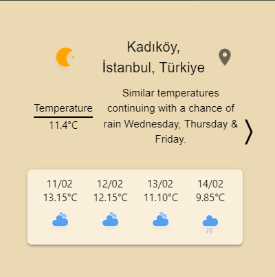
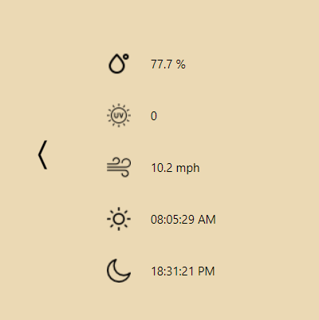

## Overview

The Weather Chrome Extension is a simple and lightweight extension that allows users to quickly check the weather forecast directly from their Chrome browser. With just a click, users can access current weather conditions and forecasts for their location.

## Installation

1. Download the extension from the [Chrome Web Store](https://chromewebstore.google.com/detail/weather-app/jmgkmgdbipcpdmohllejnchgpoicelam?hl=tr&utm_source=ext_sidebar).
2. Click on the "Add to Chrome" button.
3. Once installed, click on the extension icon in the toolbar to access weather information.

